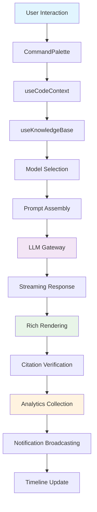

## 📌 **AI Productivity App - Realistic Implementation Plan**

*Detailed feature specifications based on current codebase state and realistic implementation timeline*

## 🚩 **Current State Analysis**

### ✅ **Already Implemented Components**
- **KnowledgeContextPanel** - ✅ Exists at `frontend/src/components/knowledge/KnowledgeContextPanel.jsx`
- **SmartKnowledgeSearch** - ✅ Exists at `frontend/src/components/knowledge/SmartKnowledgeSearch.jsx`
- **KnowledgeAssistant** - ✅ Exists at `frontend/src/components/chat/KnowledgeAssistant.jsx`
- **ModelSwitcher** - ✅ Exists at `frontend/src/components/chat/ModelSwitcher.jsx`
- **PromptManager** - ✅ Exists at `frontend/src/components/settings/PromptManager.jsx`
- **StreamingMessage** - ✅ Exists at `frontend/src/components/chat/StreamingMessage.jsx`
- **EnhancedMessageRenderer** - ✅ Exists at `frontend/src/components/chat/EnhancedMessageRenderer.jsx`
- **CitationRenderer** - ✅ Exists at `frontend/src/components/chat/CitationRenderer.jsx`
- **ResponseQuality** - ✅ Exists at `frontend/src/components/analytics/ResponseQuality.jsx`
- **InteractiveElements** - ✅ Exists at `frontend/src/components/chat/InteractiveElements.jsx`
- **ResponseTransformer** - ✅ Exists at `frontend/src/components/chat/ResponseTransformer.jsx`

### ✅ **Already Implemented Hooks**
- **useKnowledgeChat** - ✅ Exists in `frontend/src/hooks/useKnowledgeContext.js`
- **useModelSelection** - ✅ Exists in `frontend/src/hooks/useModelSelect.js`
- **useModelPerformance** - ✅ Exists in `frontend/src/hooks/useModelSelect.js`
- **useResponseQualityTracking** - ✅ Exists in `frontend/src/components/analytics/ResponseQuality.jsx`
- **useChat** - ✅ Exists in `frontend/src/hooks/useChat.js`
- **useProject** - ✅ Exists in `frontend/src/hooks/useProjects.js`
- **useCodeSearch** - ✅ Exists in `frontend/src/hooks/useCodeSearch.js`

### 🔧 **Current Issues Found & Fixed**

1. **ChatPage.jsx Naming Issue** - ✅ FIXED
   - File was incorrectly named `EnhancedChatPage` but should be `ChatPage`
   - Updated export function name to match expected usage

2. **SplitPane Component Usage** - ✅ FIXED
   - Current implementation uses `Allotment` library with different props
   - Simplified usage to match actual component interface

3. **Import Paths Validated** - ✅ VERIFIED
   - All imported components exist at specified paths
   - Hook imports are correct and functional

## 🚩 **Phase 1: Integration & Polish (Week 1-2)**

### 🔹 **A. Knowledge Context & Search**

#### **1. KnowledgeContextPanel** (`frontend/src/components/knowledge/KnowledgeContextPanel.jsx`) **≤200 LOC**

**Core Features:**
- **Real-time Relevant Documents:** Display dynamic document list based on current chat context and cursor position
- **Semantic Similarity Indicators:** Visual cosine similarity scores (0.0-1.0) with color-coded relevance badges
- **Citation Management:** Unified source-tracking with document provenance and confidence metrics
- **Knowledge Graph Visualization:** Simplified D3.js/Vis.js graph showing document relationships and context links
- **Auto-context Injection:** Intelligent context insertion based on configurable relevance threshold (default: 0.7)

**Integration Points:**
- **Extends:** Existing `DependencyGraph.jsx` and `FileUpload.jsx` patterns
- **State Management:** Utilize `useProjectStore` and `useConfig` hooks
- **Backend Models:** `CodeDocument`, `CodeEmbedding` models with new relevance scoring fields
- **Backend Endpoint:** Extend `/api/search` to include context relevance scoring via embeddings API
- **Real-time Display:** WebSocket integration with existing `useChat` hook for live context updates

#### **2. SmartKnowledgeSearch** (`frontend/src/components/knowledge/SmartKnowledgeSearch.jsx`) **≤180 LOC**

**Core Features:**
- **Multi-modal Search:** Hybrid retrieval combining semantic embeddings + BM25 keyword matching
- **Faceted Filtering:** Filter by document type (code/docs), relevance score, date ranges, file extensions
- **Preview Results:** Snippet highlights with context windows, inline relevance scoring (visual indicators)
- **Natural Language Queries:** Parse user intent via Azure OpenAI API for semantic query expansion

**Integration Points:**
- **Backend Integration:** Leverage existing `SearchAPI` with enhanced semantic search capabilities
- **Multi-modal Engine:** Extend `backend/app/search/semantic.py` for file content + metadata indexing
- **NLP Query Builder:** Integrate with existing LLM client (`backend/app/llm/client.py`)
- **Frontend Hooks:** Build on `useCodeSearch` and `useSearch` patterns
- **Caching Strategy:** Implement LRU cache with IndexedDB fallback for offline search

#### **3. useKnowledgeBase Hook** (`frontend/src/hooks/useKnowledgeBase.js`) **≤120 LOC**

**Core Features:**
- **Real-time Updates:** WebSocket subscriptions for live document updates and relevance changes
- **Caching Strategies:** LRU cache with IndexedDB persistence for offline functionality
- **Prefetch Logic:** Predictive document loading based on cursor context and code analysis

**Integration Points:**
- **Pattern:** Follow existing `useProjects.js` and `useChat.js` hook patterns
- **WebSocket Integration:** Subscribe to events via existing `connection_manager`
- **Optimistic Updates:** Implement similar to `useProjectStore` for immediate UI feedback
- **Backend Models:** Utilize `CodeDocument`, `Project`, and `ChatSession` relationships

---

### 🔹 **B. Prompt & Model Orchestration**

#### **1. ModelConfiguration** (`frontend/src/components/settings/ModelConfiguration.jsx`) **≤200 LOC**

**Core Features:**
- **Visual LLM Selection:** Multi-provider UI (Azure OpenAI, Anthropic, OpenAI) with model comparison cards
- **Configurable Parameters:** Temperature sliders, token limit inputs, response format toggles (JSON/text/code)
- **Preset Management:** Save/load model configurations with A/B testing capabilities
- **Performance Metrics:** Real-time cost estimation, latency predictions, quality scores

**Integration Points:**
- **Integration:** Extend existing `SettingsPage.jsx` with new model configuration section
- **Backend Config:** Leverage `backend/app/config.py` Settings class for model presets and defaults
- **Provider Integration:** Build on existing Azure OpenAI integration patterns in `backend/app/llm/`
- **Cost Estimation:** Add new endpoint `/api/llm/estimate-cost` in `backend/app/routers/`

#### **2. ModelSwitcher** (`frontend/src/components/chat/ModelSwitcher.jsx`) **≤150 LOC**

**Core Features:**
- **Rapid Model Switching:** Dropdown/toggle interface directly within chat input area
- **Context-aware Recommendations:** Auto-suggest models based on query complexity, cost sensitivity, and task type
- **Utilization Visualization:** Real-time cost tracking, token usage meters, rate limit indicators

**Integration Points:**
- **Integration Location:** Add to existing `CommandInput.jsx` as inline component
- **Context Awareness:** Leverage `useChat` and `useProject` for intelligent model suggestions
- **Backend Service:** Extend `ChatProcessor` to handle model selection metadata and routing
- **State Management:** Integrate with `useAuthStore` for user preferences and model history

#### **3. PromptManager** (`frontend/src/components/chat/PromptManager.jsx`) **≤180 LOC**

**Core Features:**
- **Template Library:** Reusable prompt templates with variable placeholders (`{{variable}}` syntax)
- **Variable Injection:** Real-time preview with dynamic variable substitution
- **Effectiveness Metrics:** Track prompt performance (response quality, latency, user satisfaction)

**Integration Points:**
- **Backend Integration:** Extend `backend/app/chat/` with prompt templates storage and versioning
- **Template Storage:** Add new `PromptTemplate` model to `backend/app/models/` with version control
- **Versioning:** Integrate with existing timeline system (`TimelineEvent`) for prompt history
- **Analytics:** Leverage existing WebSocket broadcasting for usage tracking and metrics

#### **4. useModelSelection Hook** (`frontend/src/hooks/useModelSelection.js`) **≤120 LOC**

**Core Features:**
- **Auto-selection Logic:** Intelligent model routing based on detected task type (code/chat/analysis)
- **Fallback Chains:** Graceful degradation with availability and load balancing
- **Rate Limiting:** Transparent handling with exponential backoff and user feedback

**Integration Points:**
- **Pattern:** Follow `useConfig.js` caching and state management approach
- **Dynamic Selection:** Integrate with `ChatService` for context-aware model routing
- **Rate Limiting:** Leverage existing `SecurityHeadersMiddleware` patterns for request throttling
- **Fallback Chain:** Build resilience into existing `LLMClient` error handling mechanisms

---

### 🔹 **C. Streaming Chat & Rich Rendering**

#### **1. RichMessageRenderer** (`frontend/src/components/chat/RichMessageRenderer.jsx`) **≤250 LOC**

**Core Features:**
- **Multi-format Rendering:** Text, syntax-highlighted code, Mermaid/D3 diagrams, tables, charts, KaTeX math
- **Interactive Elements:** Expandable citations, hover-to-preview source references, copy-to-clipboard actions
- **Progressive Enhancement:** Graceful fallback for unsupported content types

**Integration Points:**
- **Extension Point:** Enhance existing `MessageList.jsx` with rich content rendering capabilities
- **Syntax Highlighting:** Build on existing `react-syntax-highlighter` in `CodeSnippet.jsx`
- **Mermaid Integration:** Add mermaid dependency to `package.json`, implement diagram rendering
- **Math Rendering:** Integrate KaTeX for mathematical notation with LaTeX syntax support
- **Table Support:** Extend markdown parsing with GitHub-flavored table rendering

#### **2. StreamingMessage** (`frontend/src/components/chat/StreamingMessage.jsx`) **≤180 LOC**

**Core Features:**
- **Token-by-token Rendering:** Progressive display from SSE streaming responses
- **Code Block Handling:** Detect and properly render incomplete code blocks mid-stream
- **Stream Control:** Pause, resume, and cancel capabilities with visual progress indicators

**Integration Points:**
- **Backend Integration:** Leverage existing `StreamingHandler` in `backend/app/llm/streaming.py`
- **WebSocket Protocol:** Extend existing chat WebSocket messages with streaming chunk handling
- **Token Rendering:** Implement incremental DOM updates for smooth streaming visualization
- **Error Handling:** Integrate with existing `ErrorBoundary.jsx` patterns for stream failures

#### **3. CitationRenderer** (`frontend/src/components/chat/CitationRenderer.jsx`) **≤150 LOC**

**Core Features:**
- **Inline Citations:** Numbered badges ([1], [2]) with hover-to-preview functionality
- **Source Previews:** Small tooltip summaries with document metadata and confidence scores
- **Reference Management:** Expanded references list with source verification and link-out capability

**Integration Points:**
- **Knowledge Integration:** Connect with `CodeDocument` search results and embeddings
- **Hover Previews:** Implement portal-based tooltips following existing `Toast.jsx` patterns
- **Verification:** Add backend endpoint `/api/knowledge/verify-citation` for source validation
- **UI Integration:** Enhance existing message metadata display with citation information

---

### 🔹 **D. Global States & Feedback**

#### **Enhanced State Components** (`frontend/src/components/common/`) **≤100 LOC each**

**1. ErrorState.jsx**
- **Clear Error Display:** Detailed error messages with actionable recovery suggestions
- **Retry Functionality:** Smart retry buttons with exponential backoff and loading states

**2. EmptyState.jsx**
- **Consistent Empty States:** Contextual empty state messaging with suggested actions
- **Visual Design:** Follow existing design system with appropriate illustrations/icons

**3. SkeletonLoader.jsx**
- **Adaptive Placeholders:** Dynamic skeleton shapes matching intended content (cards, lists, tables)
- **Seamless Transitions:** Smooth loading-to-content transitions with proper timing

**Integration Points:**
- **Design Consistency:** Follow existing Tailwind theme and design system patterns
- **Error Handling:** Use in all major components following `TimelineErrorBoundary.jsx` pattern
- **Loading States:** Implement consistent loading UX across all async operations

---

## 🚩 **Phase 2: Editor & Commands (Week 3-4)**

### 🔹 **E. Command Palette & Advanced Commands**

#### **1. CommandPalette** (`frontend/src/components/common/CommandPalette.jsx`) **≤180 LOC**

**Core Features:**
- **Fuzzy Search Interface:** Cmd+K triggered palette with intelligent command matching
- **Context-aware Suggestions:** Commands filtered by current file type, selection, and project state
- **Command History:** Recent command access with frequency-based ranking

**Integration Points:**
- **Global Integration:** Add keyboard shortcut handler to existing `Layout.jsx` component
- **Command Registry:** Extend existing slash commands in `backend/app/chat/commands.py`
- **Fuzzy Search:** Client-side filtering with Fuse.js or similar for command suggestions
- **Context Awareness:** Integrate with current route and selected project state from stores
- **Backend Endpoint:** `/api/chat/commands` for dynamic command discovery and metadata

#### **2. Advanced Commands** (`backend/app/chat/advanced_commands.py`) **≤300 LOC**

**Core Features:**
- **Enhanced Command Set:**
  - `/refactor`: AST-based refactoring suggestions with before/after previews
  - `/review`: PR-style code review with diff integration and suggestion comments
  - `/optimize`: Performance analysis with bottleneck identification and recommendations
  - `/security`: Security vulnerability scanning with remediation suggestions
  - `/document`: Auto-documentation generation with JSDoc/docstring formatting
  - `/debug`: Interactive debugging assistance with breakpoint suggestions
  - `/architecture`: High-level architecture analysis and design pattern recommendations

**Integration Points:**
- **Command Handlers:** Extend existing command registry with context-aware processing
- **Infrastructure:** Leverage existing `ChatProcessor` and `CodeParser` components
- **File Processing:** Utilize existing `TreeSitter` and `SemanticChunker` for code analysis
- **LLM Integration:** Connect with model orchestration for command-specific model selection

---

### 🔹 **F. AI-Powered Code Actions**

#### **1. AICodeActions** (`frontend/src/components/editor/AICodeActions.jsx`) **≤200 LOC**

**Core Features:**
- **Ghost Text Suggestions:** Inline AI suggestions triggered on cursor idle or Cmd+. activation
- **Quick Fixes:** Auto-fixes for ESLint, TypeScript, and custom AI-detected code issues
- **Smart Refactoring:** Context-aware refactoring suggestions based on code smells and complexity metrics

**Integration Points:**
- **Monaco Integration:** Extend existing `MonacoEditor` usage in `CodeChat.jsx`
- **Code Action Providers:** Register Monaco editor code action providers for AI suggestions
- **Backend Service:** New `/api/code/ai-actions` endpoint for real-time code analysis
- **Error Integration:** Connect with existing linting and error reporting systems

---

### 🔹 **G. Enhanced Diff & Merge**

#### **1. EnhancedDiffEditor** (`frontend/src/components/editor/EnhancedDiffEditor.jsx`) **≤250 LOC**

**Core Features:**
- **Three-way Merge Visualization:** Visual highlighting of incoming, outgoing, and conflict regions
- **AI Conflict Resolution:** Intelligent merge suggestions with explanations for proposed changes
- **Inline Commenting:** Comment system for collaborative diff review and discussion

**Integration Points:**
- **Extension Base:** Enhance existing `DiffView.jsx` component with advanced merge capabilities
- **AI Integration:** Connect with LLM services for intelligent conflict resolution suggestions
- **File Management:** Integrate with existing file management in `ProjectChatPage.jsx`
- **Git Integration:** Leverage existing Git operations for merge conflict detection and resolution

---

### 🔹 **H. Symbol Navigation & Smart Explorer**

#### **1. SymbolNavigator** (`frontend/src/components/editor/SymbolNavigator.jsx`) **≤150 LOC**

**Core Features:**
- **Go-to Definition:** Quick navigation with Monaco LSP integration
- **Find References:** Comprehensive reference finding across project files
- **Breadcrumb Navigation:** Visual hierarchy showing current symbol nesting and context
- **Symbol Minimap:** Enhanced minimap with symbol highlights and quick navigation

**Integration Points:**
- **LSP Integration:** Extend existing code analysis with Language Server Protocol support
- **Backend Service:** Add LSP integration to code processing pipeline
- **UI Patterns:** Follow existing sidebar navigation patterns and design system
- **Cross-file References:** Leverage existing `CodeDocument` relationships and indexing

#### **2. SmartFileExplorer** (`frontend/src/components/editor/SmartFileExplorer.jsx`) **≤200 LOC**

**Core Features:**
- **Fuzzy File Search:** Cmd+P integration with intelligent file matching
- **Git Status Indicators:** Visual indicators for modified, staged, and conflict files
- **Favorites & Recents:** Productivity sections for frequently accessed files
- **Smart Grouping:** Intelligent file organization by type, recent activity, and relevance

**Integration Points:**
- **Extension Point:** Enhance file listing in `ProjectChatPage.jsx` sidebar
- **Git Integration:** Leverage existing `GitPython` backend integration for file status
- **User Preferences:** Integrate with user preferences and project timeline for recents
- **Search Integration:** Connect with existing search infrastructure for file discovery

#### **3. useCodeContext Hook** (`frontend/src/hooks/useCodeContext.js`) **≤150 LOC**

**Core Features:**
- **Real-time Symbol Tracking:** Monitor cursor position, selected symbols, and code context
- **AST Integration:** Leverage parsed syntax trees for semantic understanding
- **Cross-file Awareness:** Track dependencies and references across project files

**Integration Points:**
- **AST Integration:** Utilize existing `TreeSitter` parsing from backend services
- **Backend API:** `/api/code/context` endpoint for AST information and symbol data
- **WebSocket Updates:** Real-time collaboration awareness for shared editing contexts
- **State Management:** Follow existing hook patterns for caching and optimistic updates

---

## 🚩 **Phase 3: Productivity & UX Polish (Week 5-6)**

### 🔹 **I. Notification Center**

#### **1. NotificationCenter** (`frontend/src/components/notifications/NotificationCenter.jsx`) **≤150 LOC**

**Core Features:**
- **Smart Grouping:** Notifications organized by type (system, chat, project) with collapsible sections
- **Real-time Updates:** Live notification feed with WebSocket integration and fallback polling
- **Batch Operations:** Mark all read, bulk clear, pagination for large notification volumes

**Integration Points:**
- **Backend Integration:** Leverage existing `NotifyManager` and WebSocket `/ws/notify` endpoint
- **UI Integration:** Add to existing `Header.jsx` with notification badge and slide-out panel
- **Persistence:** Store notification preferences and history in `useAuthStore`
- **Theming:** Follow existing design system and theme integration

#### **2. useNotifications Hook** (`frontend/src/hooks/useNotifications.js`) **≤100 LOC**

**Core Features:**
- **Queue Management:** Centralized notification queue with priority handling and throttling
- **Persistence:** Local storage for notification history and user preferences
- **Smart Batching:** Intelligent grouping and throttling for smooth UX

**Integration Points:**
- **WebSocket Integration:** Connect to existing notification WebSocket endpoint
- **State Management:** Follow patterns from `useAuth` and `useChat` hooks
- **Local Storage:** Implement persistence following existing storage patterns

---

### 🔹 **J. Analytics & Telemetry**

#### **1. ResponseQuality** (`frontend/src/components/analytics/ResponseQuality.jsx`) **≤180 LOC**

**Core Features:**
- **Metrics Capture:** Relevance, accuracy, and user satisfaction scoring (1-5 star ratings)
- **Visual Analytics:** Intuitive graphs and charts using Recharts for trend visualization
- **Actionable Insights:** Model effectiveness reports with optimization recommendations

**Integration Points:**
- **Backend Analytics:** Extend `ChatMessage` model with quality metadata fields
- **Feedback System:** Add rating interface to existing message components
- **Dashboard Integration:** Add analytics section to existing settings page
- **API Endpoint:** `/api/analytics/response-quality` for metrics collection and reporting

#### **2. SearchAnalytics** (`frontend/src/components/analytics/SearchAnalytics.jsx`) **≤120 LOC**

**Core Features:**
- **Search Tracking:** Monitor search queries, result clicks, and user satisfaction
- **Click-through Analysis:** Track user interaction patterns with search results
- **Relevance Feedback:** Collect user feedback on search result usefulness

**Integration Points:**
- **Search Tracking:** Extend existing search API with analytics collection middleware
- **Backend Integration:** Add analytics collection to existing search services
- **Visualization:** Implement analytics dashboards with existing charting components

#### **3. Event Bus System** (`frontend/src/utils/eventBus.js`) **≤80 LOC**

**Core Features:**
- **Unified Event Pipeline:** Centralized system for user interactions, performance metrics, and error tracking
- **Structured Logging:** Consistent event format for analytics and debugging
- **Privacy-first:** Ensure no sensitive data leakage in analytics collection

---

### 🔹 **K. Accessibility & Mobile Optimization**

#### **1. Keyboard Navigation & Shortcuts**

**useKeyboardShortcuts** (`frontend/src/hooks/useKeyboardShortcuts.js`) **≤150 LOC**
- **Comprehensive Navigation:** Full keyboard support for all major features
- **Context-sensitive Shortcuts:** Different key bindings based on current UI context
- **Accessibility Integration:** ARIA announcements and screen reader support

**SkipLinks** (`frontend/src/components/a11y/SkipLinks.jsx`) **≤40 LOC**
- **Semantic Navigation:** Skip-to-content links for keyboard and screen reader users
- **ARIA Integration:** Proper ARIA landmark usage for navigation

#### **2. Mobile Navigation**

**MobileNav** (`frontend/src/components/mobile/MobileNav.jsx`) **≤150 LOC**
- **Touch-friendly Design:** Bottom navigation bar optimized for thumb interaction
- **Swipe Gestures:** Smooth navigation with gesture recognition

**BottomSheet** (`frontend/src/components/mobile/BottomSheet.jsx`) **≤120 LOC**
- **Pull-up Interface:** Mobile-native interaction patterns for modal content
- **Gesture Handling:** Smooth drag interactions with proper physics

#### **3. ARIA & Screen Reader Support**

**AriaLiveRegion & useAnnounce** (`frontend/src/components/a11y/`) **≤80 LOC total**
- **Dynamic Content Announcements:** Screen reader notifications for real-time updates
- **Semantic Structure:** Proper heading hierarchy and landmark usage

---

### 🔹 **L. Theme & Preferences Customization**

#### **1. ThemeCustomizer** (`frontend/src/components/preferences/ThemeCustomizer.jsx`) **≤180 LOC**

**Core Features:**
- **Dynamic Color Schemes:** User-adjustable color palettes with real-time preview
- **Typography Control:** Font family selection, size adjustment, and line height customization
- **UI Density Options:** Compact, comfortable, and spacious layout options

**Integration Points:**
- **Theme System:** Extend existing `useTheme.jsx` with advanced customization capabilities
- **Tailwind Integration:** Dynamic CSS variable updates for theme consistency
- **Persistence:** Store preferences via backend user settings API

#### **2. ShortcutEditor** (`frontend/src/components/preferences/ShortcutEditor.jsx`) **≤200 LOC**

**Core Features:**
- **Custom Key Bindings:** User-defined keyboard shortcuts with conflict detection
- **Import/Export:** Configuration backup and sharing capabilities
- **Context Awareness:** Different shortcut sets for different application contexts

**Integration Points:**
- **Keyboard System:** Connect with existing keyboard shortcut infrastructure
- **Conflict Resolution:** Prevent duplicate key bindings with user-friendly warnings
- **Settings Integration:** Persist shortcuts in user preferences system

---

## ✅ **Quality & Integration Standards**

### **Modular Architecture Principles**
- **Component Size:** ≤250 LOC per component with focused, single-responsibility design
- **Hook Complexity:** Complex state logic abstracted into custom hooks following existing patterns
- **Dependency Injection:** Avoid global states; services explicitly injected through props/context
- **Service Layer:** Business logic centralized in backend services, not duplicated in frontend

### **Performance-First Development**
- **Lazy Loading:** Heavy dependencies (Monaco editor, chart libraries) loaded on-demand
- **Web Workers:** Intensive computations (AST parsing, embeddings) offloaded to background threads
- **Caching Strategy:** Multi-layer caching (memory, IndexedDB, backend) with intelligent invalidation
- **Bundle Optimization:** Leverage Vite code splitting and tree shaking for optimal load times

### **Comprehensive Testing Strategy**
- **Frontend Testing:** Vitest + React Testing Library with ≥80% coverage requirement
- **Backend Testing:** Pytest with comprehensive API and service layer testing
- **Integration Testing:** End-to-end WebSocket and real-time feature testing
- **Accessibility Testing:** Automated a11y testing with axe-core integration
- **Performance Testing:** Bundle size monitoring and runtime performance benchmarking

### **Accessibility & Inclusive Design**
- **WCAG 2.1 AA Compliance:** Full keyboard navigation and screen reader support
- **Semantic HTML:** Proper heading hierarchy and ARIA landmark usage
- **Color Accessibility:** High contrast themes and color-blind friendly palettes
- **Motor Accessibility:** Touch-friendly targets (≥44px) and gesture alternatives
- **Cognitive Accessibility:** Clear navigation patterns and consistent interaction models

---

## 📁 **Enhanced Project Structure (Concrete Implementation Paths)**

```
frontend/src/
├── components/
│   ├── chat/                    # Enhanced chat ecosystem
│   │   ├── RichMessageRenderer.jsx       # Multi-format content rendering
│   │   ├── StreamingMessage.jsx          # Token-by-token streaming display
│   │   ├── CitationRenderer.jsx          # Source citations with previews
│   │   ├── ModelSwitcher.jsx             # Intelligent model selection UI
│   │   └── PromptManager.jsx             # Template library management
│   ├── knowledge/               # Semantic knowledge integration
│   │   ├── KnowledgeContextPanel.jsx     # Real-time context display
│   │   ├── SmartKnowledgeSearch.jsx      # Hybrid semantic + keyword search
│   │   └── CitationValidator.jsx         # Source verification interface
│   ├── editor/                  # AI-enhanced code editing
│   │   ├── AICodeActions.jsx             # Intelligent code suggestions
│   │   ├── EnhancedDiffEditor.jsx        # Advanced three-way merge
│   │   ├── SymbolNavigator.jsx           # LSP-powered symbol navigation
│   │   ├── SmartFileExplorer.jsx         # Context-aware file browser
│   │   └── GhostTextProvider.jsx         # Inline AI suggestions
│   ├── notifications/           # Real-time notification system
│   │   ├── NotificationCenter.jsx        # Grouped notification management
│   │   ├── NotificationBadge.jsx         # Header integration component
│   │   └── ToastManager.jsx              # Transient notification display
│   ├── analytics/               # Usage analytics and insights
│   │   ├── ResponseQuality.jsx           # LLM response effectiveness
│   │   ├── SearchAnalytics.jsx           # Search behavior analysis
│   │   ├── PerformanceMetrics.jsx        # System performance dashboard
│   │   └── UsageInsights.jsx             # User productivity insights
│   ├── mobile/                  # Mobile-optimized interface
│   │   ├── MobileNav.jsx                 # Touch-friendly navigation
│   │   ├── BottomSheet.jsx               # Pull-up modal interface
│   │   ├── SwipeGestures.jsx             # Gesture recognition system
│   │   └── MobileCommandPalette.jsx      # Touch-optimized command interface
│   ├── a11y/                    # Accessibility enhancement layer
│   │   ├── SkipLinks.jsx                 # Keyboard navigation helpers
│   │   ├── AriaLiveRegion.jsx            # Dynamic content announcements
│   │   ├── FocusManager.jsx              # Focus trap and management
│   │   └── ScreenReaderUtils.jsx         # SR-specific helper utilities
│   ├── preferences/             # User customization interface
│   │   ├── ThemeCustomizer.jsx           # Advanced theme personalization
│   │   ├── ShortcutEditor.jsx            # Keyboard shortcut customization
│   │   ├── ModelPreferences.jsx          # AI model preference settings
│   │   └── AccessibilitySettings.jsx     # A11y preference configuration
│   └── common/
│       ├── CommandPalette.jsx            # Global Cmd+K command interface
│       ├── ErrorState.jsx               # Comprehensive error handling
│       ├── EmptyState.jsx               # Contextual empty state displays
│       ├── SkeletonLoader.jsx           # Adaptive loading placeholders
│       └── ProgressIndicator.jsx         # Multi-format progress display

├── hooks/
│   ├── core/                    # Fundamental application hooks
│   │   ├── useKnowledgeBase.js           # Knowledge retrieval and caching
│   │   ├── useModelSelection.js          # AI model orchestration
│   │   ├── useCodeContext.js             # Editor context and AST awareness
│   │   └── useRealTimeSync.js            # WebSocket state synchronization
│   ├── ui/                      # User interface interaction hooks
│   │   ├── useKeyboardShortcuts.js       # Global shortcut management
│   │   ├── useNotifications.js           # Notification queue handling
│   │   ├── useAnnounce.js                # Accessibility announcement system
│   │   └── useGestures.js                # Touch gesture recognition
│   ├── analytics/               # Usage tracking and metrics
│   │   ├── useAnalytics.js               # Event tracking and metrics
│   │   ├── usePerformanceMonitor.js      # Performance measurement
│   │   └── useUserBehavior.js            # Behavior pattern analysis
│   └── preferences/             # User preference management
│       ├── useThemePreferences.js        # Theme customization state
│       ├── useShortcutPreferences.js     # Keyboard shortcut state
│       └── useAccessibilityPrefs.js      # A11y preference management

├── stores/                      # Enhanced Zustand state management
│   ├── core/
│   │   ├── knowledgeStore.js             # Knowledge base state and cache
│   │   ├── modelStore.js                 # AI model selection and config
│   │   └── codeContextStore.js           # Editor context and symbols
│   ├── ui/
│   │   ├── notificationStore.js          # Notification state management
│   │   ├── commandStore.js               # Command palette state
│   │   └── navigationStore.js            # Navigation and routing state
│   └── preferences/
│       ├── themeStore.js                 # Theme customization state
│       ├── shortcutStore.js              # Keyboard shortcut configuration
│       └── accessibilityStore.js         # Accessibility preferences

├── services/                    # Frontend service layer
│   ├── api/
│   │   ├── knowledgeApi.js               # Knowledge base API integration
│   │   ├── analyticsApi.js               # Analytics data collection
│   │   └── preferencesApi.js             # User preference persistence
│   ├── workers/
│   │   ├── embeddingWorker.js            # Semantic embedding computation
│   │   ├── parsingWorker.js              # AST parsing and analysis
│   │   └── searchWorker.js               # Client-side search indexing
│   └── utils/
│       ├── performanceUtils.js           # Performance monitoring utilities
│       ├── accessibilityUtils.js         # A11y helper functions
│       └── analyticsUtils.js             # Analytics collection helpers

backend/app/
├── knowledge/                   # Knowledge base services
│   ├── __init__.py
│   ├── context_builder.py               # Semantic context extraction
│   ├── citation_service.py              # Citation validation and tracking
│   ├── embedding_service.py             # Vector embedding management
│   └── knowledge_graph.py               # Knowledge relationship modeling
├── chat/
│   ├── advanced_commands.py             # Enhanced command processors
│   ├── model_orchestrator.py            # Multi-model routing and selection
│   ├── prompt_templates.py              # Template management system
│   └── streaming_optimizer.py           # Stream processing optimization
├── analytics/                   # Analytics and telemetry
│   ├── __init__.py
│   ├── metrics_service.py               # Usage and performance tracking
│   ├── quality_analyzer.py              # Response quality assessment
│   └── behavior_analyzer.py             # User behavior pattern analysis
├── editor/                      # Code intelligence services
│   ├── __init__.py
│   ├── lsp_integration.py               # Language Server Protocol support
│   ├── symbol_analyzer.py               # Code symbol analysis
│   └── refactoring_service.py           # AI-powered refactoring suggestions
├── routers/
│   ├── knowledge.py                     # Knowledge base API endpoints
│   ├── analytics.py                     # Analytics collection endpoints
│   ├── preferences.py                   # User preference management
│   ├── commands.py                      # Advanced command handling
│   └── editor.py                        # Code intelligence endpoints
├── models/
│   ├── knowledge.py                     # Knowledge base data models
│   ├── prompt_template.py               # Prompt template storage
│   ├── user_preferences.py              # User preference models
│   ├── analytics.py                     # Analytics data models
│   └── editor.py                        # Code intelligence models
└── services/
    ├── knowledge_service.py             # Knowledge retrieval service
    ├── model_service.py                 # AI model management service
    ├── analytics_service.py             # Analytics processing service
    └── preference_service.py            # User preference service
```

---

## 🛠️ **Technical Implementation Guidelines**

### **Backend Development Patterns (Python/FastAPI)**

#### **Architectural Consistency**
- **Dependency Injection:** Utilize existing `DatabaseDep`, `CurrentUserRequired` patterns for all new endpoints
- **Model Extensions:** Extend SQLAlchemy models with proper Alembic migrations and backward compatibility
- **Router Organization:** Follow existing patterns in `app/routers/` with consistent error handling and validation
- **Service Layer:** Centralize business logic in `app/services/` following existing service patterns

#### **Real-time Integration**
- **WebSocket Management:** Leverage existing `ConnectionManager` for all real-time features
- **Message Broadcasting:** Use established message patterns for notification and update distribution
- **Connection Lifecycle:** Implement proper cleanup and reconnection handling for WebSocket connections

#### **Data & Security**
- **Input Validation:** Use Pydantic models for all request/response validation following existing patterns
- **Authentication Integration:** All endpoints must integrate with existing JWT authentication system
- **Rate Limiting:** Implement rate limiting using existing middleware patterns for all new endpoints
- **Error Handling:** Use existing exception handling patterns with proper logging and user feedback

### **Frontend Development Patterns (React/JavaScript)**

#### **Component Architecture**
- **Hook Conventions:** Follow established patterns from `useAuth.js`, `useProjects.js`, `useChat.js`
- **State Management:** Utilize Zustand stores following `projectStore.js` patterns with proper action creators
- **Component Organization:** Maintain existing PropTypes conventions and component structure
- **Error Boundaries:** Wrap complex components with existing error boundary patterns

#### **Performance Optimization**
- **Code Splitting:** Implement route-based and component-based lazy loading using React.lazy()
- **Bundle Management:** Leverage Vite's built-in optimization with proper chunk sizing
- **Memory Management:** Implement proper cleanup in useEffect hooks and event listeners
- **Render Optimization:** Use React.memo and useMemo for expensive computations

#### **Styling & Design**
- **Tailwind Consistency:** Use existing Tailwind classes and maintain design system consistency
- **Theme Integration:** Follow existing theme patterns with CSS custom properties
- **Responsive Design:** Implement mobile-first responsive design following existing breakpoint patterns
- **Animation Standards:** Use consistent animation timing and easing following existing UI patterns

### **Integration & Communication Patterns**

#### **API Integration**
- **HTTP Client:** Follow patterns from existing API modules in `src/api/` with proper error handling
- **Request/Response Types:** Maintain TypeScript/JSDoc type consistency across all API interactions
- **Caching Strategy:** Implement intelligent caching with proper invalidation following existing patterns
- **Optimistic Updates:** Use optimistic UI updates for better perceived performance

#### **Real-time Features**
- **WebSocket Protocol:** Extend existing WebSocket message types with proper versioning
- **State Synchronization:** Implement proper conflict resolution for concurrent updates
- **Connection Management:** Handle connection drops, reconnection, and offline scenarios gracefully
- **Message Queuing:** Implement proper message ordering and delivery guarantees

#### **Cross-component Communication**
- **Event System:** Use existing event patterns for loose coupling between components
- **State Sharing:** Leverage Zustand stores for shared state with proper action creators
- **Context Usage:** Use React Context sparingly, following existing patterns for theme and auth
- **Component Communication:** Prefer props and callbacks over complex state management

---

## 🔄 **Enhanced Integration Workflow & Data Flow**



### **Detailed Data Flow Integration**

#### **1. Input Processing Layer**
```
User Input → CommandPalette → Command Parser → Context Assembler
                ↓
Existing: CommandInput.jsx + Slash Command Infrastructure
Enhanced: Advanced command recognition with NLP parsing
```

#### **2. Context Assembly Layer**
```
Project Context + Knowledge Base + Code Context → Unified Context
                ↓
Existing: Project store + Code document system
Enhanced: Semantic similarity scoring + Real-time context updates
```

#### **3. Model Orchestration Layer**
```
Context + User Preferences + Task Type → Model Selection → Prompt Assembly
                ↓
Existing: ChatProcessor + LLM client infrastructure
Enhanced: Multi-model routing + Cost optimization + Fallback chains
```

#### **4. Response Processing Layer**
```
LLM Response → Stream Parser → Rich Renderer → UI Update
                ↓
Existing: WebSocket infrastructure + Message rendering
Enhanced: Real-time streaming + Multi-format rendering + Citation tracking
```

#### **5. Knowledge Integration Layer**
```
Response + Citations → Knowledge Store → Search Index → Timeline Update
                ↓
Existing: Code document storage + Timeline system
Enhanced: Semantic indexing + Citation validation + Knowledge graph updates
```

#### **6. Analytics & Feedback Layer**
```
User Interactions + Response Quality → Analytics Collection → Insights Generation
                ↓
Existing: Basic usage tracking
Enhanced: Comprehensive analytics + Quality metrics + Behavioral insights
```

---

## 📋 **Comprehensive Definition of Done**

### **Code Quality & Architecture Standards**
- [ ] **Module Size:** ≤250 LOC per component/module with clear single responsibility
- [ ] **Type Safety:** Complete TypeScript/JSDoc coverage with zero linting errors
- [ ] **Testing Coverage:** ≥80% unit test coverage + integration tests + accessibility tests
- [ ] **Performance Benchmarks:** Initial interaction ≤150ms, proper lazy loading implementation
- [ ] **Security Compliance:** Input validation, XSS prevention, proper authentication integration
- [ ] **Code Review:** Peer review with architectural compliance verification

### **Integration & Compatibility Requirements**
- [ ] **Authentication Integration:** Seamless integration with existing `useAuth` system and JWT flow
- [ ] **Real-time Features:** WebSocket integration for collaborative features with proper error handling
- [ ] **State Management:** Proper integration with existing Zustand stores and state patterns
- [ ] **API Consistency:** Follow established API patterns with proper error handling and validation
- [ ] **Cross-browser Support:** Compatibility testing across Chrome, Firefox, Safari, Edge
- [ ] **Backward Compatibility:** No breaking changes to existing functionality

### **User Experience & Accessibility Standards**
- [ ] **Accessibility Compliance:** Full WCAG 2.1 AA compliance with keyboard navigation and screen reader support
- [ ] **Mobile Responsiveness:** Touch-friendly interactions with proper gesture support
- [ ] **Performance Optimization:** Bundle size monitoring with lazy loading for heavy components
- [ ] **Error Handling:** Graceful degradation with user-friendly error messages and recovery options
- [ ] **Loading States:** Consistent skeleton loading patterns with proper progress indicators
- [ ] **Keyboard Support:** Complete keyboard navigation with logical tab order

### **Documentation & Deployment Requirements**
- [ ] **API Documentation:** Complete OpenAPI specifications for all new endpoints
- [ ] **Component Documentation:** Comprehensive JSDoc for all public components and hooks
- [ ] **Database Migrations:** Proper Alembic migrations for all schema changes
- [ ] **Environment Configuration:** Updated environment variable documentation and examples
- [ ] **User Documentation:** Updated user guides and feature documentation
- [ ] **Deployment Scripts:** Updated Docker configurations and deployment procedures

### **Analytics & Monitoring Integration**
- [ ] **Performance Monitoring:** Client-side performance tracking with Core Web Vitals
- [ ] **Error Tracking:** Comprehensive error logging and monitoring integration
- [ ] **Usage Analytics:** User interaction tracking with privacy compliance
- [ ] **Quality Metrics:** Response quality tracking and model performance monitoring
- [ ] **Accessibility Monitoring:** Automated a11y testing in CI/CD pipeline
- [ ] **Security Monitoring:** Security event logging and anomaly detection

---

## 📌 **Implementation Strategy & Milestones**

### **Phase 1 Milestone: Core Knowledge Loop (Week 2)**
- [ ] Knowledge context panel with real-time document relevance
- [ ] Smart search with hybrid semantic + keyword matching
- [ ] Model orchestration with intelligent selection
- [ ] Rich message rendering with streaming support
- [ ] Basic citation system with source verification

### **Phase 2 Milestone: Enhanced Development Tools (Week 4)**
- [ ] Command palette with advanced AI commands
- [ ] AI-powered code actions and suggestions
- [ ] Enhanced diff editor with conflict resolution
- [ ] Symbol navigation with LSP integration
- [ ] Smart file explorer with context awareness

### **Phase 3 Milestone: Production Ready UX (Week 6)**
- [ ] Comprehensive notification system
- [ ] Analytics dashboard with quality metrics
- [ ] Full accessibility compliance
- [ ] Mobile-optimized interface
- [ ] Advanced customization and preferences

### **Quality Gates at Each Milestone**
- [ ] All tests passing with ≥80% coverage
- [ ] Performance benchmarks met
- [ ] Accessibility audit passed
- [ ] Security review completed
- [ ] User acceptance testing completed

---

This comprehensive implementation plan provides detailed, actionable guidance for building a sophisticated AI productivity application that integrates seamlessly with the existing codebase while adding powerful new capabilities. Each feature is grounded in concrete technical requirements and follows established architectural patterns to ensure maintainability and scalability.

---

_Last updated: June 20, 2025_
