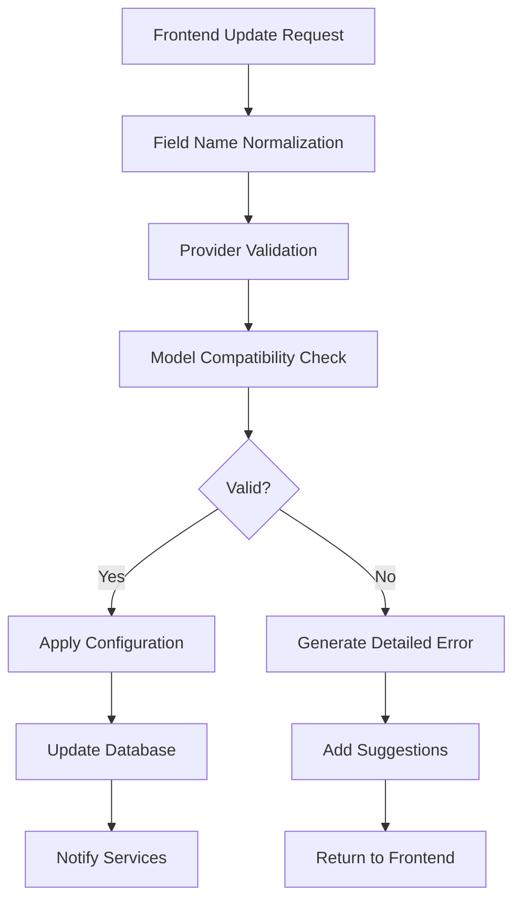

# AI Configuration System - Architecture Documentation

## Overview

The AI Configuration System has been redesigned to address critical architectural issues while maintaining backward compatibility. This document outlines the improvements and how to use the new system effectively.

## Key Improvements

### 1. Field Name Normalization

The system now properly handles field name conversions between camelCase (frontend) and snake_case (backend):

- **Problem**: Frontend sends `modelId`, backend expects `model_id`, causing "Field required" errors
- **Solution**: `ConfigValidationService.normalize_field_names()` automatically converts between naming conventions
- **Impact**: No more field name mismatch errors

### 2. Provider-Aware Validation

Configuration validation now understands provider-specific requirements:

```python
# Example: Azure requires specific fields
validator.validate_provider_requirements("azure", config)
# Returns: (False, ["Azure OpenAI endpoint not configured in environment"])

# Example: Claude models don't support standard reasoning
validator.validate_provider_requirements("anthropic", {"enable_reasoning": True})
# Returns: (False, ["Claude models use extended thinking, not standard reasoning"])
```

### 3. Smart Preset Management

Presets now adapt to the current provider automatically:

```python
# Preset "powerful" adapts to each provider:
# - OpenAI: Uses gpt-4o with enable_reasoning
# - Azure: Uses o3 reasoning model with responses API
# - Anthropic: Uses claude-opus-4 with extended thinking
```

### 4. Clear Error Messages

Instead of generic "Field required; Field required", users now see:

- "Missing required configuration fields. The selected preset may not be compatible with your current provider."
- "Azure OpenAI endpoint not configured in environment"
- "Model o3 does not support temperature control (must be 1.0)"

### 5. Configuration Compatibility Layer

The system now handles provider switching gracefully:

```python
# When switching from OpenAI to Anthropic:
# - enable_reasoning → claude_extended_thinking
# - reasoning_effort → claude_thinking_mode
# - Suggests equivalent models
```

## Architecture Components

### Backend Services

1. **ConfigValidationService** (`config_validation_service.py`)
   - Field name normalization
   - Provider-specific validation
   - Model compatibility checks
   - Error message enhancement

2. **ConfigPresetManager** (`config_preset_manager.py`)
   - Provider-aware preset definitions
   - Configuration adaptation between providers
   - Model equivalence mapping

3. **UnifiedConfigService** (updated)
   - Uses validation service for all updates
   - Provides detailed error messages
   - Handles preset application with provider awareness

4. **ConfigurationErrorMiddleware** (`config_error_handler.py`)
   - Intercepts configuration errors
   - Provides user-friendly error messages
   - Suggests actionable solutions

### Frontend Integration

The frontend context (`AIConfigContext.jsx`) now:
- Handles detailed error messages from the backend
- Displays provider-specific suggestions
- Maintains configuration consistency

## Usage Examples

### Applying a Preset

```javascript
// Frontend
const { applyPreset } = useAIConfig();
await applyPreset("powerful"); // Automatically adapts to current provider

// Backend handles:
// 1. Detects current provider (e.g., "azure")
// 2. Applies Azure-specific "powerful" config (o3 model)
// 3. Validates against Azure requirements
// 4. Returns clear errors if misconfigured
```

### Switching Providers

```python
# Backend automatically handles conversions
update = {"provider": "anthropic", "model_id": "claude-opus-4-20250514"}

# System will:
# 1. Validate Anthropic API key is configured
# 2. Convert any OpenAI/Azure settings to Claude equivalents
# 3. Check model compatibility
# 4. Provide clear errors if issues exist
```

### Error Handling

```python
# Clear validation errors with suggestions
{
    "detail": "Missing required configuration fields. The selected preset may not be compatible with your current provider.",
    "error_type": "validation_error", 
    "suggestions": [
        "Try selecting a different preset",
        "Ensure your environment is configured for the correct provider",
        "Use the 'balanced' preset which works across all providers"
    ]
}
```

## Migration Guide

### For Backend Developers

1. **Use the validation service for all config updates**:
   ```python
   validation_service = ConfigValidationService(db)
   valid, errors, normalized = validation_service.validate_config_update(current, update)
   ```

2. **Apply presets through the preset manager**:
   ```python
   preset_manager = ConfigPresetManager(db)
   config = preset_manager.apply_preset("balanced", current_config)
   ```

### For Frontend Developers

1. **Handle detailed error responses**:
   ```javascript
   try {
     await updateConfig(configData);
   } catch (e) {
     const errorMsg = e.response?.data?.detail || e.message;
     const suggestions = e.response?.data?.suggestions || [];
     // Display errorMsg and suggestions to user
   }
   ```

2. **Use provider-aware presets**:
   ```javascript
   // Presets now work across all providers
   await applyPreset("powerful"); // Works for OpenAI, Azure, and Anthropic
   ```

## Configuration Flow



## Best Practices

1. **Always specify provider when changing models**:
   ```javascript
   updateConfig({ provider: "azure", modelId: "o3" });
   ```

2. **Use presets for common configurations**:
   ```javascript
   applyPreset("balanced"); // Works across all providers
   ```

3. **Check environment configuration**:
   - OpenAI: Requires `OPENAI_API_KEY`
   - Azure: Requires `AZURE_OPENAI_ENDPOINT` and `AZURE_OPENAI_API_KEY`
   - Anthropic: Requires `ANTHROPIC_API_KEY`

4. **Handle provider-specific features**:
   - Azure/OpenAI: `enable_reasoning`, `reasoning_effort`
   - Anthropic: `claude_extended_thinking`, `claude_thinking_mode`

## Troubleshooting

### Common Issues

1. **"Field required" errors**
   - Check if preset is compatible with current provider
   - Ensure all required environment variables are set
   - Try using a different preset

2. **Model not available**
   - Verify model exists for the selected provider
   - Check model_configurations table for available models
   - Use equivalent models when switching providers

3. **Provider switching fails**
   - Ensure target provider credentials are configured
   - Check if current model has equivalent in target provider
   - Use presets which handle provider adaptation automatically

### Debug Mode

Enable detailed logging:
```python
import logging
logging.getLogger("app.services.config_validation_service").setLevel(logging.DEBUG)
logging.getLogger("app.services.config_preset_manager").setLevel(logging.DEBUG)
```

## Future Enhancements

1. **Dynamic preset discovery** - Load presets from database
2. **User-defined presets** - Allow users to save custom configurations
3. **A/B testing support** - Compare configurations side-by-side
4. **Cost optimization** - Suggest cheaper models with similar capabilities
5. **Performance profiling** - Track which configurations perform best

## Conclusion

The improved AI Configuration System provides a robust, provider-aware configuration management solution that:
- Eliminates field name confusion
- Provides clear, actionable error messages
- Handles provider switching gracefully
- Adapts presets to different providers automatically
- Maintains backward compatibility

This architecture ensures a smooth user experience while maintaining the flexibility to work with multiple AI providers.
