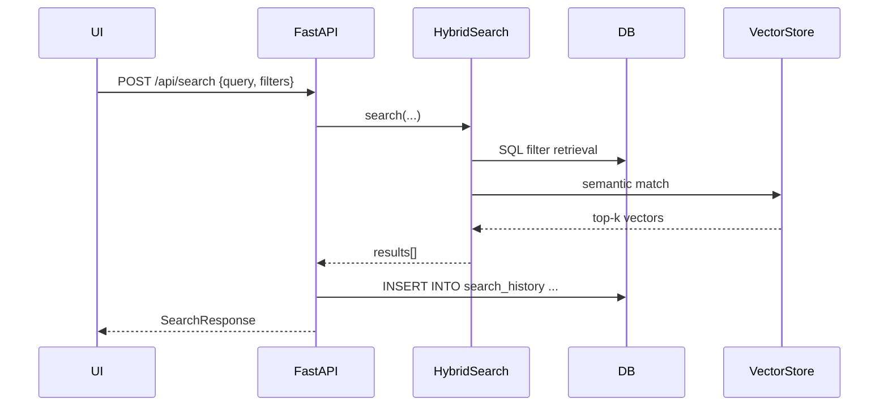

# Search Functionality – Developer Guide

This document explains **all search-related features** across the AI-Productivity-App stack: data-model, API surface, backend logic, and frontend UX.  After reading you should be able to

* understand the flow of a query from browser → FastAPI → Hybrid Search engine → vector-store / SQL → response,
* extend the system with new search-modes, filters or post-processing steps,
* debug issues such as “no suggestions returned” or “results missing project X”.

---

## 1. Data-Model

### 1.1 `SearchHistory` (SQLAlchemy)

File `backend/app/models/search_history.py`

| Column          | Type      | Notes                                                         |
| --------------- | --------- | ------------------------------------------------------------- |
| `id`            | PK int    | Auto-increment.                                               |
| `user_id`       | FK 🔗     | Belongs to `users.id` (`ondelete=CASCADE`).                   |
| `query_text`    | varchar   | Raw text the user typed (≤255 chars).                         |
| `filters`       | JSON      | Dict mirroring `SearchRequest.filters` (optional).            |
| `project_ids`   | JSON      | Array of project IDs the query targeted.                     |
| `created_at`    | datetime  | From `TimestampMixin`.                                       |
| `updated_at`    | datetime  | From `TimestampMixin`.                                       |

Indices

* `idx_search_history_user_created` – (`user_id`, `created_at`) – used together with an **ORDER BY `created_at` DESC** clause to fetch the most-recent rows.  (SQLite/PostgreSQL can read the index backwards, so an explicit `DESC` is not required.)
* `idx_search_history_query` – (`query_text`) – enables LIKE prefix search for suggestions.

Relationships

* `User.search_history` – lazy `selectin` for efficient batch loading.
* `SearchHistory.user` – eager (joined) load (`lazy=False`) to avoid an extra SELECT when history rows are accessed.

Migration: `backend/alembic/versions/003_add_search_history.py`.

---

## 2. API Surface (FastAPI)

All endpoints are prefixed with `/api/search` (router in `backend/app/routers/search.py`).

| Method & Path            | Purpose                                                       |
| ------------------------ | ------------------------------------------------------------- |
| `POST /api/search`       | Execute query (hybrid/semantic/keyword/structural).           |
| `GET  /api/search/suggestions` | Autocomplete suggestions while user types.                |
| `GET  /api/search/history`     | Return recent queries for the authenticated user.        |
| `POST /api/search/index`       | (Admin) Re/Index a single document’s embeddings.         |
| `DELETE /api/search/index/{id}`| Remove document embeddings.                              |

### 2.1 Request/Response Flow – `POST /api/search`

1. **Project scope** – If caller did not provide `project_ids`, backend resolves to *all projects owned* by the user.
2. **HybridSearch** – See service classes `HybridSearch`, `VectorStore`, `EmbeddingService`.
3. **Formatting** – Raw engine results mapped to `SearchResult` (pydantic) array.
4. **History persistence** – on **successful** search execution the query is appended to `SearchHistory` (best-effort, exceptions swallowed).



### 2.2 Suggestions – `GET /api/search/suggestions?q=...`

Composition strategy:

1. **Slash-commands** – `/explain`, `/generate-tests`, etc.
2. **Structural prefixes** – `func:`, `class:`, `file:` … (first token before `:`).
3. **Search history** – Most recent 50 queries for the user, prefix-matched (case-insensitive) then deduplicated.

Backend returns `{ "suggestions": ["..."] }` trimmed to 10 items.

### 2.3 History – `GET /api/search/history?limit=20`

Returns list ordered by `created_at DESC`:

```jsonc
{
  "history": [
     {
       "id": 42,
       "query": "func:handleSubmit",
       "filters": {"language": "python"},
       "project_ids": [1],
       "created_at": "2025-06-09T13:45:02.123Z"
     }
  ]
}
```

---

### 2.4 Helper – `HybridSearch.get_context_for_query()`

Several backend services (e.g. the Chat endpoints) need a concise piece of *code-context* to feed
into an LLM prompt.  They call the coroutine below (private – **not** an HTTP API):

```python
context = await HybridSearch(db, vector_store, embed_gen).get_context_for_query(
    query="How is authentication implemented?",
    project_ids=[42],
    max_tokens=4000,
)
```

The helper executes a short hybrid search, ranks & de-duplicates results, concatenates the top
snippets and truncates the final string to `max_tokens`.

---

## 3. Front-End Integration (React + Vite)

### 3.1 API helper

`frontend/src/api/search.js`

```js
searchAPI.search(params)
searchAPI.getSuggestions(q)
searchAPI.getHistory(limit)
```

### 3.2 SearchBar.jsx (autocomplete)

* Uses `useDebounce` (200 ms) before hitting `/suggestions`.
* Keyboard navigation ↑ ↓ ↩ etc.

### 3.3 AdvancedSearch.jsx (full page)

* Maintains `searchMode` (hybrid / semantic / keyword / structural).
* Loads history on mount via `searchAPI.getHistory()` with graceful fallback to `localStorage` (offline / unauth).
* Button **History** toggles split-view to list saved searches.
* **Save Search** still writes to `localStorage` – independent from server-side history (acts like bookmarks).

### 3.4 SearchResults.jsx (list & previews)

* Path `frontend/src/components/search/SearchResults.jsx`.
* Renders paginated list of results with file-path header, match-percentage badge, and an embedded `CodeSnippet` preview for the first 15 lines.

### 3.5 SearchFilters.jsx (sidebar)

* Path `frontend/src/components/search/SearchFilters.jsx`.
* Form for language, symbol-type, file-type, project selection, *Clear All* etc.  Updates local state which the hooks propagate back to the backend.

### 3.6 CodeSnippet.jsx (syntax highlighted preview)

* Path `frontend/src/components/search/CodeSnippet.jsx`.
* Uses `react-syntax-highlighter` (Atom One Dark) with line numbers, language label, truncated overlay when >15 lines.

### 3.7 SearchPage.jsx (stand-alone page)

* Path `frontend/src/pages/SearchPage.jsx` — full screen page that wraps **SearchBar**, **SearchFilters**, **SearchResults**, supports project check-boxes, dependency-graph link, URL sync (`?q=` param).

### 3.8 Hooks

* `frontend/src/hooks/useSearch.js` – main search hook used by *AdvancedSearch* & *SearchPage* (handles debounce, abort, error state, etc.).
* `frontend/src/hooks/useCodeSearch.js` – lighter variant used by other pages.
* `frontend/src/hooks/useDebounce.js` – generic debounce helper (already referenced above).

> The components above deliberately keep rendering / state separate so you can swap them into other pages (e.g. a project-scoped search modal) without dragging along the entire AdvancedSearch UI.

---

## 4. Extending Search

1. **New search-mode** – Add constant to selector array (`AdvancedSearch.jsx`) and implement branch inside `HybridSearch.search()`.
2. **Extra filter** – Extend `SearchRequest.filters` pydantic model → propagate into service.
3. **Global suggestions** – Add logic to `/suggestions` after structural-prefix block.

---

## 5. Troubleshooting & Tips

| Symptom                                        | Checklist                                                   |
| ---------------------------------------------- | ----------------------------------------------------------- |
| Empty suggestions                              | Verify `GET /api/search/suggestions` returns data. Check auth header. |
| History not recorded                           | Look for warnings “Failed to persist search history” in backend logs. |
| Duplicate `Table already defined` error        | Ensure models include `__table_args__ = {...'extend_existing':True}` when re-imported in tests. |
| Vector results feel irrelevant                 | Confirm embeddings are up-to-date (`POST /api/search/index`). |

---

## 6. Road-Map Ideas

* Popular queries analytics (aggregate `SearchHistory`).
* Per-project hot-phrases.
* Delete / clear history endpoint.
* Sync *saved* searches (currently only `localStorage`) to server.

---

© 2025 AI-Productivity-App Team
