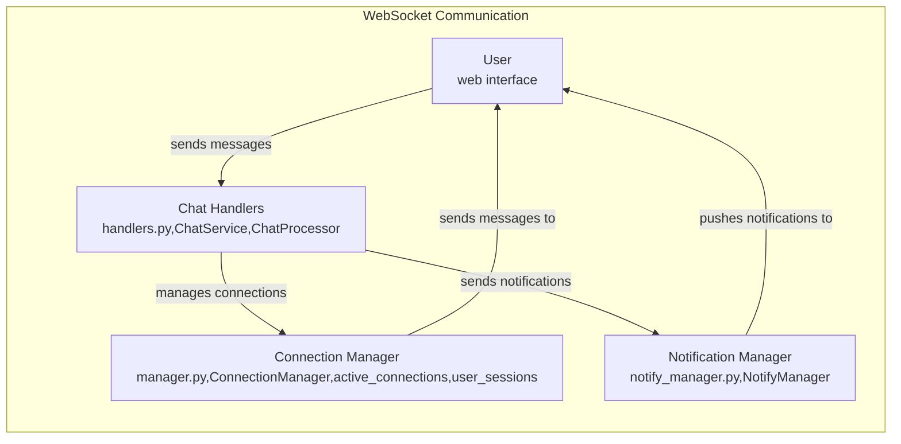

# Codebase Research Report

## Query
Websockets

## Answer
### System Diagram

### Summary
# CodeViz Websockets

## Backend WebSocket Implementation

The backend utilizes WebSockets for real-time communication, primarily for chat functionality and user notifications. The implementation is located in the `ai-productivity-app/backend/app/websocket` directory.

### Key Components

-   **handlers.py (file:ai-productivity-app/backend/app/websocket/handlers.py)**
    -   Defines WebSocket handlers for the chat functionality.
    -   Manages the WebSocket connection lifecycle for chat sessions.
    -   Processes messages from users, interacts with the `ChatService` (from `app/services/chat_service.py`) and `ChatProcessor` (from `app/chat/processor.py`), and sends responses back to the client.
    -   Handles message types: `message`, `edit_message`, `delete_message`, and `typing`.
    -   Uses the `connection_manager` (from `manager.py`) to manage active WebSocket connections.
-   **manager.py (file:ai-productivity-app/backend/app/websocket/manager.py)**
    -   Defines the `ConnectionManager` class (node:ConnectionManager_CM123) for managing WebSocket connections.
    -   Handles connecting, disconnecting, and sending messages to WebSocket clients.
    -   Maintains dictionaries to track active WebSocket connections (`active_connections`) and user sessions (`user_sessions`).
    -   Provides methods for sending messages to specific sessions (`send_message`) and broadcasting to all sessions associated with a user (`broadcast_to_user`).
    -   A global instance of the `ConnectionManager` called `connection_manager` is created (file:ai-productivity-app/backend/app/websocket/manager.py:92).
-   **notify\_manager.py (file:ai-productivity-app/backend/app/websocket/notify_manager.py)**
    -   Defines a global, user-centric WebSocket notification manager.
    -   Allows backend tasks to push JSON events to specific users via WebSocket connections.
    -   Maintains an in-memory mapping of `user_id` to a list of active `WebSocket` connections for that user.
    -   Provides methods for connecting (`connect`), disconnecting (`disconnect`), and sending messages (`send`) to users.
    -   A single instance of the `NotifyManager` class, `notify_manager`, is created.
    -   The code anticipates a future move to a multi-process environment with a Redis pub/sub backend.

## Frontend WebSocket Usage

While initial searches didn't reveal direct WebSocket usage in `useWebSocket.js`, further investigation might be needed to understand how the frontend interacts with the backend WebSocket endpoints.

## Walkthrough Steps

### 1. WebSocket Implementation Overview
The backend uses WebSockets for real-time communication, specifically for chat and user notifications. The core components are `handlers.py`, `manager.py`, and `notify_manager.py`. The system manages WebSocket connections, processes messages, and pushes notifications to users.

### 2. Chat Handlers
The `handlers.py` file defines WebSocket handlers for chat functionality. It manages the WebSocket connection lifecycle, processes messages from users, interacts with `ChatService` and `ChatProcessor`, and sends responses back to the client. It handles message types such as `message`, `edit_message`, `delete_message`, and `typing`. It uses the `connection_manager` to manage active WebSocket connections.

### 3. Connection Management
The `ConnectionManager` class, defined in `manager.py`, handles WebSocket connections. It manages connecting, disconnecting, and sending messages to WebSocket clients. It maintains dictionaries to track active WebSocket connections (`active_connections`) and user sessions (`user_sessions`). It provides methods for sending messages to specific sessions (`send_message`) and broadcasting to all sessions associated with a user (`broadcast_to_user`). A global instance, `connection_manager`, is created.

### 4. User Notification Management
The `notify_manager.py` defines a global, user-centric WebSocket notification manager. It allows backend tasks to push JSON events to specific users via WebSocket connections. It maintains an in-memory mapping of `user_id` to a list of active `WebSocket` connections for that user. It provides methods for connecting (`connect`), disconnecting (`disconnect`), and sending messages (`send`) to users. A single instance of the `NotifyManager` class, `notify_manager`, is created. The code anticipates a future move to a multi-process environment with a Redis pub/sub backend.

## Detailed Sub-Search Results

### 1. Summarize the purpose and functionality of handlers.py in the ai-productivity-app/backend/app/websocket directory. (LoA: mid)
Based on the file content, here's a summary of `handlers.py`:

*   **Purpose:** This file defines the WebSocket handlers for the chat functionality of the AI productivity app. It manages WebSocket connections, receives and processes messages from users, interacts with the chat service and chat processor, and sends responses back to the client.

*   **Functionality:**
    *   **`handle_chat_connection` Function:**
        *   Manages the WebSocket connection lifecycle for a chat session.
        *   Connects the user to the session using the `connection_manager` (from `.manager.py`).
        *   Sends a connection confirmation message to the client.
        *   Retrieves and sends recent chat messages to the client.
        *   Enters a loop to receive and process messages from the client.
        *   Handles different message types:
            *   `message`: Creates a new chat message using `ChatService`, then processes it with the `ChatProcessor`.
            *   `edit_message`: Updates an existing message using `ChatService`.
            *   `delete_message`: Deletes a message using `ChatService`.
            *   `typing`: Broadcasts typing indicators to other users in the session.
        *   Handles `WebSocketDisconnect` exceptions to manage disconnections gracefully.
    *   **`serialize_message` Function:**
        *   Converts a `ChatMessage` object (from `app/models/chat.py`) into a JSON-serializable dictionary. This is necessary for sending messages over the WebSocket.

*   **Key Components and Interactions:**
    *   `connection_manager` (from `.manager.py`): Manages active WebSocket connections.
    *   `ChatService` (from `app/services/chat_service.py`): Provides methods for creating, retrieving, updating, and deleting chat messages.
    *   `ChatProcessor` (from `app/chat/processor.py`): Processes chat messages, likely involving AI-related tasks.
    *   `User` (from `app/models/user.py`): Represents the user connected to the WebSocket.
    *   `ChatMessage` (from `app/models/chat.py`): Represents a chat message.

In summary, `handlers.py` acts as the central point for managing WebSocket communication in the chat feature, coordinating between the connection manager, chat service, and chat processor to handle user interactions and AI processing.

### 2. Summarize the purpose and functionality of manager.py in the ai-productivity-app/backend/app/websocket directory. (LoA: mid)
Okay, I have read the file. Now I can summarize its purpose and functionality.

*   **Purpose:** The `manager.py` file defines a `ConnectionManager` class (node:ConnectionManager_CM123) responsible for managing WebSocket connections in a chat application. It handles connecting, disconnecting, and sending messages to WebSocket clients.

*   **Functionality:**
    *   **Connection Management:**
        *   The `ConnectionManager` class maintains dictionaries to track active WebSocket connections (`active_connections`) and user sessions (`user_sessions`). `active_connections` maps session IDs to lists of WebSocket objects, while `user_sessions` maps user IDs to sets of session IDs.
        *   The `connect` method accepts a new WebSocket connection, associates it with a session ID and user ID, and adds it to the `active_connections` and `user_sessions` dictionaries. It uses a lock (`_lock`) for thread safety.
        *   The `disconnect` method removes a WebSocket connection from the `active_connections` and `user_sessions` dictionaries when a client disconnects. It also uses a lock for thread safety.
    *   **Message Sending:**
        *   The `send_message` method sends a JSON message to all WebSocket connections within a specific session. It iterates through the connections in the session and attempts to send the message. If a message fails to send (due to a disconnected client, for example), it removes the WebSocket from the active connections.
        *   The `broadcast_to_user` method sends a message to all sessions associated with a particular user. It iterates through the user's sessions and calls `send_message` for each session.
    *   **Session User Count:**
        *   The `get_session_users` method returns the number of users currently connected to a given session.
    *   **Global Instance:**
        *   A global instance of the `ConnectionManager` called `connection_manager` is created at the end of the file, making it accessible throughout the application. (file:ai-productivity-app/backend/app/websocket/manager.py:92)

In summary, `manager.py` provides a centralized component for managing WebSocket connections, associating them with users and sessions, and facilitating message broadcasting in a chat application.

### 3. Summarize the purpose and functionality of notify_manager.py in the ai-productivity-app/backend/app/websocket directory. (LoA: mid)
Okay, I have read the file. Now I can summarize its purpose and functionality.

*   **Purpose:** The `notify_manager.py` file defines a global, user-centric WebSocket notification manager. It's designed to allow backend tasks to push JSON events to specific users via WebSocket connections.

*   **Functionality:**
    *   **User-Centric:** Each logged-in user establishes one WebSocket connection per browser tab to `/ws/notify`.
    *   **In-Memory Mapping:** The manager maintains an in-memory mapping of `user_id` to a list of active `WebSocket` connections for that user.
    *   **`NotifyManager` Class:**
        *   `connect(websocket: WebSocket, user_id: int)`: Accepts a new WebSocket connection for a given user, adding it to the list of connections for that user. Uses a lock for thread safety.
        *   `disconnect(websocket: WebSocket, user_id: int)`: Removes a WebSocket connection from the list of connections for a user. If the user has no more connections, the user entry is removed.
        *   `send(user_id: int, payload: dict)`: Sends a JSON payload to all active WebSocket connections associated with a given user. It handles potential disconnection errors by removing faulty WebSockets.
    *   **Singleton Instance:** A single instance of the `NotifyManager` class, `notify_manager`, is created and made available for use throughout the application.
    *   **Planned Extension:** The code anticipates a future move to a multi-process environment (Gunicorn) or external workers, where a Redis pub/sub backend will be introduced behind the same interface.

In summary, `notify_manager.py` provides a simple, in-memory solution for sending real-time notifications to users via WebSockets. It manages WebSocket connections on a per-user basis and offers methods for connecting, disconnecting, and sending messages. (file:ai-productivity-app/backend/app/websocket/notify_manager.py)

---
*Generated by [CodeViz.ai](https://codeviz.ai) on 6/21/2025, 2:30:10 AM*
